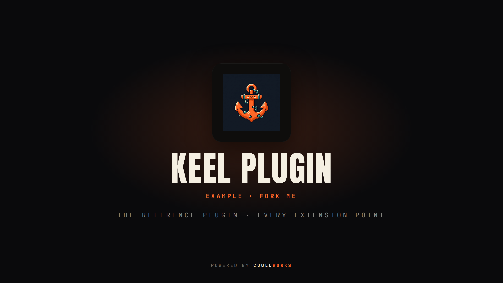

<p align="center">
  
</p>

<h1 align="center">keel-plugin-example</h1>

<p align="center">
  <b>The reference keel plugin.</b> Every extension point, over keel's subprocess protocol. <b>Fork it to build your own.</b><br>
  <a href="https://github.com/coullworks/keel">⚓ built for keel</a> · <a href="LICENSE">MIT</a>
</p>

---

The reference [keel](https://github.com/coullworks/keel) plugin. **Fork it to build your own.**

This one plugin demonstrates **every extension point keel offers**, so you can
clone it, delete what you don't need, and rename the rest. The back end is plain
shell (`bin/*`) on purpose: a keel plugin can be written in **any language**,
because keel talks to it over a small subprocess + JSON protocol and never loads
its code. The only JavaScript here is the two UI *components* — and those are the
plugin's own React bundles, mounted as-is.

## How keel finds it

keel scans its managed plugin dir (`~/.config/keel/plugins`) **and every root on
`KEEL_PLUGIN_PATH`**. Clone this repo anywhere on a `KEEL_PLUGIN_PATH` root and
keel finds it — no install step:

```sh
export KEEL_PLUGIN_PATH="$HOME/dev/keel-plugins"
git clone https://github.com/coullworks/keel-plugin-example "$KEEL_PLUGIN_PATH/example"
cd "$KEEL_PLUGIN_PATH/example/ui" && pnpm install && pnpm build   # build the UI bundles (see below)
keel plugins                 # example is listed
keel plugins trust example   # allow it to run its own executables
keel example                 # run its command
```

Nothing is enabled or trusted automatically: a plugin that only declares data
(static screens, steps) needs nothing; one that runs executables needs `trust`.

## `config/register.yaml` is the whole contract

keel reads a plugin's identity from `register.yaml` **without running anything**,
and validates it before the plugin is registered. Everything the plugin
contributes is declared there as DATA; the behaviour lives in the files the
manifest names. There are two kinds of "behaviour" file:

- **executables** (`run` / `render` / `apply`) — keel runs them as subprocesses,
  with the project in the environment (`KEEL_PROJECT_DIR` / `KEEL_FRAMEWORK` /
  `KEEL_ENV`), and reads their stdout. This is the any-language part.
- **components** (`component:`) — built ES modules the keel **studio** serves and
  mounts as React (no iframe, no code loaded into keel itself).

## Every extension point in this plugin

| # | Extension point | Declared in `register.yaml` | Backed by | What it is |
|---|---|---|---|---|
| 1 | **Command** | `commands[].run` | `bin/hello` | `keel example` — stdout streamed to the user |
| 2 | **Static screen** | `screens[].sections` | *(no code)* | a per-project screen drawn from pure data in the manifest |
| 3 | **Live screen** | `screens[].render` | `bin/screen` | a per-project screen; keel draws the View JSON the script prints |
| 4 | **Component screen** | `screens[].component` | `ui/dist/screen.js` | a per-project screen the studio mounts as React; gets `keel.dir` |
| 5 | **Wizard step (single-select)** | `steps[]` | `bin/apply` | a `keel new` step; the chosen key is passed to apply |
| 6 | **Wizard step (multi-select)** | `steps[].multi: true` | `bin/apply` | a `keel new` step; all ticked keys are passed to apply |
| 7 | **Action** | `actions[].run` | `bin/action` | a studio button; input values arrive as `key=value` args |
| 8 | **Call action (the bridge)** | `actions[].run` | `bin/echo` | the target of `keel.call()` from a component — a plugin's UI reaching its own back end |
| 9 | **Component page** | `pages[].component` | `ui/dist/page.js` | a global "Extend" page the studio mounts as React; no project |
| 10 | **Data page** | `pages[].render` | `bin/page-data` | a global "Extend" page; keel draws the View JSON the script prints — zero JS |
| 11 | **Overview** | `overview` | `bin/overview` | sections folded into a project's studio overview |
| 12 | **Recipes** | `recipes/*.yaml` | *(no code)* | recipes folded into keel's catalogue (a "pack" is just this) |
| — | **Capability** | `capabilities: [exec]` | — | the power to run its own binaries; granted once at trust time |

### The three UI tiers, side by side

keel gives a plugin three ways to put a UI in the studio. This plugin ships all
three so you can compare them:

- **Data (View JSON)** — `bin/screen`, `bin/page-data`, `bin/overview` print a
  `View` and keel draws it. The plugin never emits markup, so it **cannot break
  the studio**. Use this whenever the UI is just data.
- **Component (React, mounted)** — `ui/dist/page.js` + `ui/dist/screen.js`. The
  studio serves the bundle at `/plugin-assets/example/…` and dynamic-imports it
  (no iframe), calling the module's `mount(el, keel)`. Use this when you need real
  interactivity. **This is the modern own-UI tier.**
- **Iframe HTML (`ui: true`)** — the *deprecated* tier: the plugin printed raw
  HTML that keel hosted in a sandboxed iframe. This plugin no longer uses it; the
  component page (#9) replaces it. Reach for a component, not an iframe.

## The View — what a data-tier script prints

```json
{ "sections": [
  { "kind": "stat", "title": "This project", "items": [
    { "label": "Framework", "value": "laravel" }
  ]}
]}
```

`kind` is `stat`, `list` or `text`. An item may carry an `href` to become a link.

## The component tier — the `keel` bridge

A mounted component exports `mount(el, keel)` (and optionally `unmount(el)`). keel
hands it a `keel` object — its only channel out:

| On `keel` | What it is |
|---|---|
| `keel.plugin` | this plugin's name (`example`) |
| `keel.dir` | the focused project's path — set on a **screen**, `undefined` on a global **page** |
| `keel.call(action, args)` | runs one of the plugin's **own declared actions** and returns its JSON. For a screen, keel threads `keel.dir` so the action runs against that project. keel only proxies; the work is in the action's executable. |
| `keel.projects()` | host data: the user's tracked projects (read-only, for a picker). keel keeps its token — the component never touches the API. |

Trace it in this plugin:

- **`ui/dist/page.js`** (component **page**, global) — an input + button that calls
  `keel.call('echo', {text})` → `bin/echo` and shows the result, plus a list from
  `keel.projects()`. `keel.dir` is undefined here.
- **`ui/dist/screen.js`** (component **screen**, project-scoped) — shows `keel.dir`
  and a button that calls `keel.call('echo', …)`, which keel runs against that
  project (`KEEL_PROJECT_DIR` = `keel.dir`).

Both reach the **same** `echo` action, so one `bin/echo` backs both surfaces.

## Building the UI bundles

The React source lives under `ui/` and mirrors the sonar plugin's setup: React is
bundled in, CSS is auto-injected from JS (`vite-plugin-css-injected-by-js`), and
each entry is a self-contained ES module (`build.lib`, ES format). Two entries
means two independent `build.lib` runs (a single multi-entry build would hoist
React into a shared chunk the studio can't resolve):

```sh
cd ui
pnpm install
pnpm build          # → ui/dist/page.js + ui/dist/screen.js
```

The built bundles are **not committed** — keel serves them from disk, so a forker
just runs `pnpm build` once after cloning (CI rebuilds them to prove they build).
Point `register.yaml`'s `component:` fields at the built files
(`ui/dist/page.js`, `ui/dist/screen.js`).

## Anatomy

```
config/register.yaml   identity + everything the plugin contributes (data only)
bin/hello              the `keel example` command
bin/screen             a live studio screen (prints a View as JSON)
bin/page-data          a data page (prints a View as JSON; zero JS)
bin/overview           sections for the project overview (View JSON)
bin/action             a studio action (a button)
bin/echo               the keel.call bridge target (both components call it)
bin/apply              the wizard steps' apply (single- + multi-select keys)
ui/src/page.jsx        the component-PAGE React source  → ui/dist/page.js
ui/src/screen.jsx      the component-SCREEN React source → ui/dist/screen.js
ui/vite.config.js      builds each entry as a self-contained ES module
recipes/*.yaml         recipes this plugin ships (a "pack" is just this part)
```

## Capabilities

A plugin declares any power it needs beyond reading and writing project files —
`exec` (run its own binaries), `net`, `secrets` — under `capabilities`. keel asks
the user to grant them once, at trust time. A capability a plugin did not declare
can never be acquired. This plugin declares `exec` because it runs its own shell.

## How to fork it

1. Copy this directory and rename it (`name:` in `register.yaml`, the repo, etc.).
2. Delete the extension points you don't need — each row in the table above is
   independent. Keep only the surfaces your plugin actually offers.
3. Replace the `bin/*` scripts with your own (any language — a compiled binary is
   common; see below). Keep printing a `View` where a screen/overview/data-page is
   declared, and JSON where an action is a `keel.call` target.
4. If you keep a component tier, edit `ui/src/*.jsx` and rebuild.
5. `keel plugins test .` (add `--strict` for the release bar) validates the
   manifest and that every declared executable is present and executable — without
   running any of your code.

## Building a plugin in a compiled language

Shell is the simplest demonstration, but for a real plugin you will likely ship a
single binary. keel provides a Go helper, `github.com/coullworks/keel/pluginmain`,
that turns a `plugin.Plugin` into a `keel-<name>` binary speaking this exact
protocol — point `render`/`run` at it in `register.yaml`. (The sonar plugin does
this.) See the keel docs.

## License

[MIT](LICENSE) © CoullWorks
